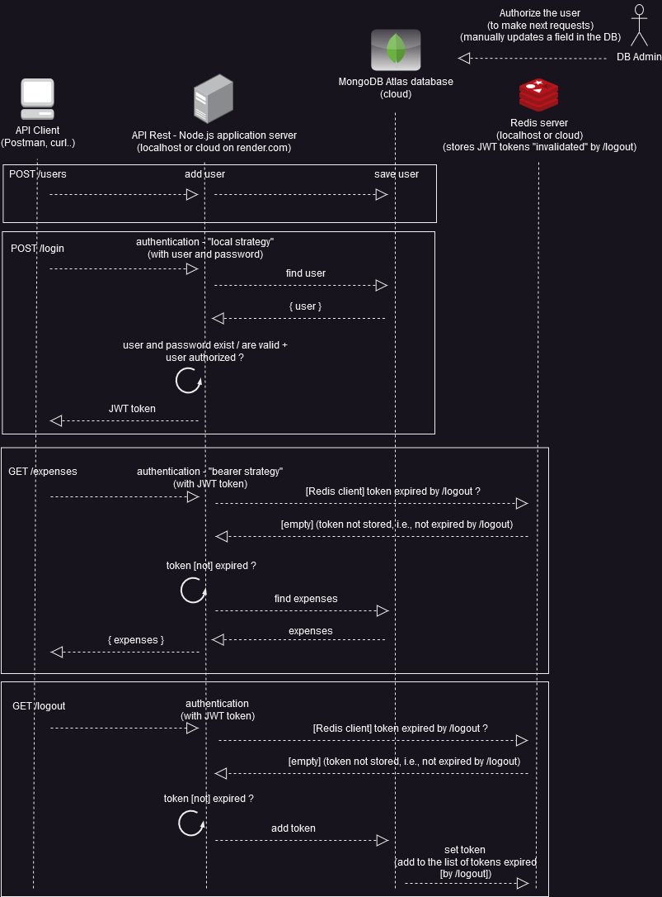

Projeto finalizado, porque há muito já atendeu ao respectivo Challenge. Porém continuará (clone) em um projeto pessoal próprio, que em um futuro não muito distante (assim espero) também será tornado púlico. :)

Alura Challenge Back-end 4: API para controle de orçamento familiar

[Documentação (pasta doc) com os passos para executar a API localmente/localhost (no seu computador)](https://github.com/Goliass/alura-challenge-back-end-4/tree/main/doc)

* Links oficiais do challenge:
  * https://www.alura.com.br/challenges/back-end-4/semana-01-implementando-api-rest
  * https://trello.com/b/ofAXrAlA/challenge-backend-semana-1
  * https://www.alura.com.br/challenges/back-end-4/semana-02-mudancas-api-novas-funcionalidades
  * https://trello.com/b/tKBmD8P6/challenge-backend-semana-2
  * https://www.alura.com.br/challenges/back-end-4/semana-03-04-seguranca-deploy-api
  * https://trello.com/b/qFYXUVXJ/challenge-backend-semana-3

* Tasks (cópia do trello do Challenge): 
  * https://trello.com/b/LL2pc08f/challenge-backend-alura-semana-1
  * https://trello.com/b/RK6N4fBh/challenge-backend-alura-semana-2
  * https://trello.com/b/dLfm1W5j/challenge-backend-alura-semana-3

* Principais "ferramentas" / tecnologias utilizadas:

  * banco de dados MongoDB Atlas: serviço de banco em nuvem
  * back-end com NodeJS / expressjs / mongoose
  * execução das rotas com Postman
  * autenticação e afins com bcrypt, passport e jsonwebtoken
  * manipulação de variáveis de ambiente com dotenv
  * deploy / API on-line com / no [render](https://render.com/)
  * banco de dados em memória Redis (necessário para a rota de logout)

* Diagrama (requisições)  
  
  * representação geral de algumas requisições. **Atenção**: pode não refletir o estado atual do código/API.
